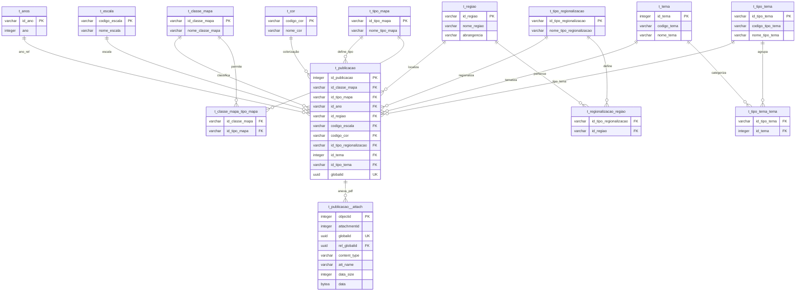
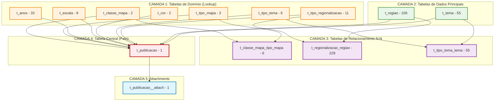
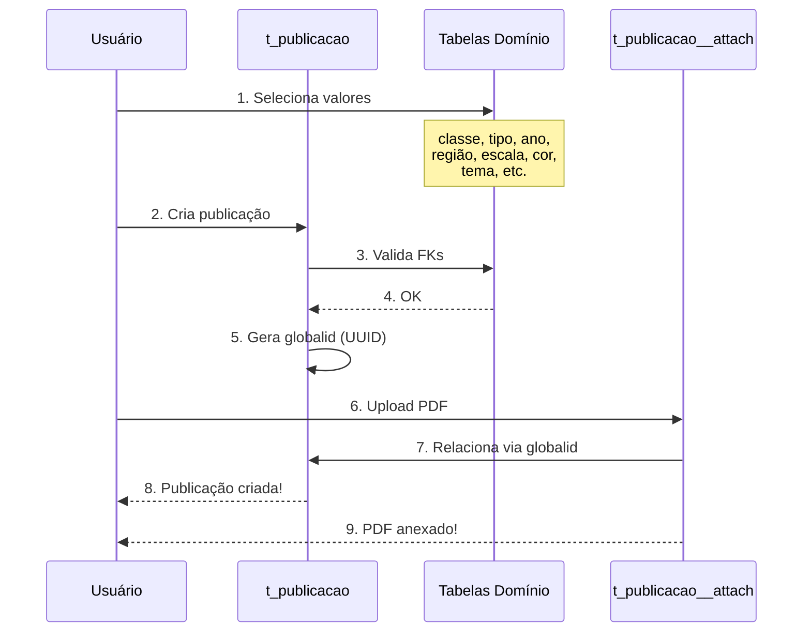

# 📊 DFD - Sistema Mapoteca Digital

## Diagrama de Fluxo de Dados (Data Flow Diagram)

```mermaid
graph TB
    %% ============================================================================
    %% DIAGRAMA DE FLUXO DE DADOS - MAPOTECA DIGITAL
    %% Database: mapoteca
    %% Schema: dados_mapoteca
    %% Data: 2025-11-14
    %% ============================================================================
    
    %% ENTIDADE CENTRAL
    PUBLICACAO[("t_publicacao<br/>📄 PUBLICAÇÃO<br/>1 registro")]
    
    %% TABELAS DE DOMÍNIO (Lookup Tables)
    CLASSE[("t_classe_mapa<br/>🏷️ CLASSE<br/>2 registros")]
    TIPO[("t_tipo_mapa<br/>🗺️ TIPO<br/>3 registros")]
    ANO[("t_anos<br/>📅 ANOS<br/>33 registros")]
    REGIAO[("t_regiao<br/>🌍 REGIÃO<br/>106 registros")]
    ESCALA[("t_escala<br/>📏 ESCALA<br/>9 registros")]
    COR[("t_cor<br/>🎨 COR<br/>2 registros")]
    TIPO_REG[("t_tipo_regionalizacao<br/>🗂️ TIPO REG<br/>11 registros")]
    TEMA[("t_tema<br/>📚 TEMA<br/>55 registros")]
    TIPO_TEMA[("t_tipo_tema<br/>📋 TIPO TEMA<br/>6 registros")]
    
    %% TABELAS DE RELACIONAMENTO N:N
    CLASSE_TIPO[("t_classe_mapa_tipo_mapa<br/>🔗 N:N<br/>6 registros")]
    REG_REG[("t_regionalizacao_regiao<br/>🔗 N:N<br/>229 registros")]
    TEMA_TIPO[("t_tipo_tema_tema<br/>🔗 N:N<br/>55 registros")]
    
    %% TABELA DE MUNICÍPIOS
    MUNICIPIOS[("t_municipios<br/>🏘️ MUNICÍPIOS<br/>417 registros")]

    %% TABELA DE PUBLICAÇÕES MUNICIPAIS
    PUB_MUN[("t_publicacao_municipios<br/>📄 PUB MUNICIPAIS<br/>0 registros")]

    %% TABELAS DE ATTACHMENTS
    ATTACH[("t_publicacao__attach<br/>📎 PDFs ESTADUAIS<br/>1 registro")]
    ATTACH_MUN[("t_publicacao_municipios_attach<br/>📎 PDFs MUNICIPAIS<br/>0 registros")]

    %% RELACIONAMENTOS PUBLICACAO → DOMÍNIOS
    CLASSE -->|id_classe_mapa| PUBLICACAO
    TIPO -->|id_tipo_mapa| PUBLICACAO
    ANO -->|id_ano| PUBLICACAO
    REGIAO -->|id_regiao| PUBLICACAO
    ESCALA -->|codigo_escala| PUBLICACAO
    COR -->|codigo_cor| PUBLICACAO
    TIPO_REG -->|id_tipo_regionalizacao| PUBLICACAO
    TEMA -->|id_tema| PUBLICACAO
    TIPO_TEMA -->|id_tipo_tema| PUBLICACAO
    
    %% RELACIONAMENTOS N:N
    CLASSE -->|id_classe_mapa| CLASSE_TIPO
    TIPO -->|id_tipo_mapa| CLASSE_TIPO
    
    TIPO_REG -->|id_tipo_regionalizacao| REG_REG
    REGIAO -->|id_regiao| REG_REG
    
    TIPO_TEMA -->|id_tipo_tema| TEMA_TIPO
    TEMA -->|id_tema| TEMA_TIPO
    
    %% RELACIONAMENTO MUNICÍPIOS
    MUNICIPIOS -->|codmun| PUB_MUN

    %% RELACIONAMENTOS ATTACHMENTS
    PUBLICACAO -->|globalid → rel_globalid| ATTACH
    PUB_MUN -->|globalid → rel_globalid| ATTACH_MUN

    %% ESTILOS
    classDef publicacao fill:#e8f5e9,stroke:#388e3c,stroke-width:3px,color:#000
    classDef dominio fill:#fff3e0,stroke:#f57c00,stroke-width:2px,color:#000
    classDef relacao fill:#f3e5f5,stroke:#7b1fa2,stroke-width:2px,color:#000
    classDef attach fill:#e1f5fe,stroke:#0277bd,stroke-width:2px,color:#000
    classDef municipios fill:#fce4ec,stroke:#c2185b,stroke-width:2px,color:#000

    class PUBLICACAO,PUB_MUN publicacao
    class CLASSE,TIPO,ANO,REGIAO,ESCALA,COR,TIPO_REG,TEMA,TIPO_TEMA,MUNICIPIOS dominio
    class CLASSE_TIPO,REG_REG,TEMA_TIPO relacao
    class ATTACH,ATTACH_MUN attach
```



---

## 🔄 Diagrama de Relacionamentos (Entity Relationship)



---

## 📈 Diagrama de Arquitetura em Camadas



---

## 🔢 Estatísticas do Banco

| Métrica | Valor |
|---------|-------|
| **Total de Tabelas** | 18 |
| **Tabelas de Domínio** | 9 |
| **Tabelas de Dados** | 2 |
| **Tabelas de Relacionamento** | 3 |
| **Tabelas de Publicação** | 2 |
| **Tabelas de Attachments** | 2 |
| **Total de Registros** | 1.210+ |

---

## 📋 Detalhamento das Tabelas

### 🏷️ Tabelas de Domínio (Lookup)

| Tabela | Registros | Função |
|--------|-----------|--------|
| `t_classe_mapa` | 2 | Mapa ou Cartograma |
| `t_tipo_mapa` | 3 | Estadual, Regional, Municipal |
| `t_anos` | 33 | Anos disponíveis |
| `t_escala` | 9 | Escalas cartográficas |
| `t_cor` | 2 | Colorido ou P&B |
| `t_tipo_tema` | 6 | Categorias de temas |
| `t_tipo_regionalizacao` | 11 | Tipos de divisão regional |
| `t_regiao` | 106 | Regiões da Bahia |
| `t_tema` | 55 | Temas dos mapas |
| `t_municipios` | 417 | Municípios com informações territoriais |

### 🔗 Tabelas de Relacionamento N:N

| Tabela | Registros | Função |
|--------|-----------|--------|
| `t_classe_mapa_tipo_mapa` | 6 | Combinações válidas |
| `t_regionalizacao_regiao` | 229 | Regiões por tipo |
| `t_tipo_tema_tema` | 55 | Temas por categoria |

### 📄 Tabelas de Publicação

| Tabela | Registros | Função |
|--------|-----------|--------|
| `t_publicacao` | 1+ | Publicações de mapas estaduais/regionais |
| `t_publicacao_municipios` | 0+ | Publicações de mapas municipais |

### 📎 Attachments

| Tabela | Registros | Função |
|--------|-----------|--------|
| `t_publicacao__attach` | 1+ | PDFs das publicações estaduais/regionais |
| `t_publicacao_municipios_attach` | 0+ | PDFs das publicações municipais |

---

## 🎯 Fluxo de Dados Principal



---

## 📊 Cardinalidades

### Publicação → Domínios (1:N)
```
1 classe_mapa → N publicações
1 tipo_mapa → N publicações
1 ano → N publicações
1 região → N publicações
1 escala → N publicações
1 cor → N publicações
1 tipo_regionalização → N publicações
1 tema → N publicações
1 tipo_tema → N publicações
```

### Publicação → Attachments (1:N)
```
1 publicação → N PDFs
```

### Relacionamentos N:N
```
N classes ↔ N tipos (via t_classe_mapa_tipo_mapa)
N tipos_regionalização ↔ N regiões (via t_regionalizacao_regiao)
N tipos_tema ↔ N temas (via t_tipo_tema_tema)
```

---

## 🔑 Campos Chave

### Primary Keys (PK)
- `t_publicacao.id_publicacao` (SERIAL)
- `t_publicacao__attach.objectid` (SERIAL)
- Demais tabelas: campos VARCHAR como PK

### Unique Keys (UK)
- `t_publicacao.globalid` (UUID)
- `t_publicacao__attach.globalid` (UUID)

### Foreign Keys (FK)
- `t_publicacao`: 9 FKs para tabelas de domínio
- `t_publicacao__attach.rel_globalid` → `t_publicacao.globalid`

---

**Versão:** 2.0
**Data:** 2025-11-17
**Database:** mapoteca
**Schema:** dados_mapoteca
**Total de Registros:** 1.210+
