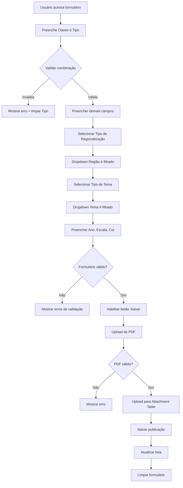
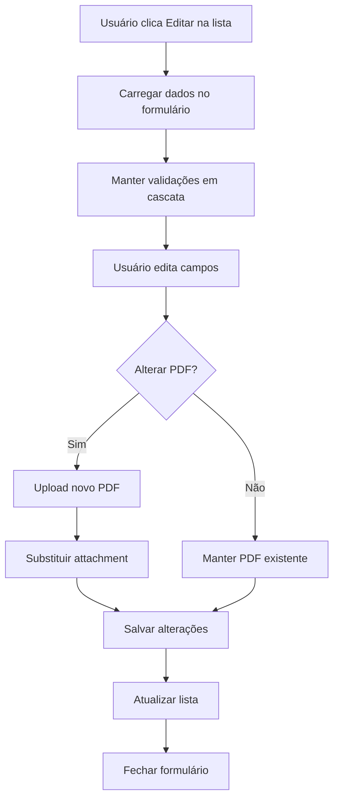

# 🎨 Experience Builder Configuration - Mapoteca Digital

## 📋 Visão Geral

Este documento especifica a configuração do frontend da Mapoteca Digital usando **ArcGIS Experience Builder** com widgets nativos (100% low-code, sem customização).

**Princípio:** Minimizar código customizado, maximizar uso de widgets nativos ESRI.

---

## 🎯 Objetivo do Formulário

Substituir o processo manual de Excel (30min) por formulário automatizado (5min), incluindo:

- ✅ Cadastro de novos mapas
- ✅ Upload de PDFs via Attachments
- ✅ Validações em cascata (dropdowns inteligentes)
- ✅ Edição de registros existentes
- ✅ Visualização inline de PDFs
- ✅ Compatibilidade com 4 apps existentes

---

## 🏗️ Arquitetura da Interface

```
┌─────────────────────────────────────────────────────────────┐
│              MAPOTECA DIGITAL - CADASTRO                    │
├─────────────────────────────────────────────────────────────┤
│                                                             │
│  [Header Widget]  Logo + Título + User Info                │
│                                                             │
├─────────────────────────────────────────────────────────────┤
│                                                             │
│  ┌─────────────────┐  ┌──────────────────────────────┐    │
│  │                 │  │                              │    │
│  │   [List        │  │   [Form Widget]              │    │
│  │    Widget]      │  │                              │    │
│  │                 │  │   Campos do Formulário       │    │
│  │   Publicações   │  │   + Validações               │    │
│  │   Recentes      │  │   + Dropdowns Cascata        │    │
│  │                 │  │                              │    │
│  │   [Filtros]     │  ├──────────────────────────────┤    │
│  │                 │  │                              │    │
│  └─────────────────┘  │   [Attachment Widget]        │    │
│                       │                              │    │
│                       │   Upload de PDFs             │    │
│                       │   (Drag & Drop)              │    │
│                       │                              │    │
│                       └──────────────────────────────┘    │
│                                                             │
├─────────────────────────────────────────────────────────────┤
│  [Footer Widget]  Botões: Salvar | Cancelar | Limpar      │
└─────────────────────────────────────────────────────────────┘
```

---

## 📦 Widgets Necessários (Todos Nativos)

### 1. **Header Widget**
**Propósito:** Branding e informações do usuário

**Configuração:**
```json
{
  "type": "Header",
  "config": {
    "title": "Mapoteca Digital - Sistema de Cadastro",
    "logo": "/assets/logo-sei-ba.png",
    "showUser": true,
    "showSignOut": true,
    "links": [
      {
        "label": "Mapas Estaduais",
        "url": "/apps/mapas-estaduais"
      },
      {
        "label": "Mapas Regionais",
        "url": "/apps/mapas-regionais"
      },
      {
        "label": "Mapas Municipais",
        "url": "/apps/mapas-municipais"
      },
      {
        "label": "Cartogramas",
        "url": "/apps/cartogramas"
      }
    ]
  }
}
```

---

### 2. **Form Widget** ⭐ PRINCIPAL
**Propósito:** Formulário de cadastro com validações

**Data Source:** FS_Mapoteca_Publicacoes/0 (t_publicacao)

**Campos do Formulário:**

#### **Seção 1: Classificação**

**Campo: Classe do Mapa** (Obrigatório)
```json
{
  "fieldName": "id_classe_mapa",
  "label": "Classe do Mapa",
  "type": "dropdown",
  "required": true,
  "dataSource": "FS_Mapoteca_Dominios/t_classe_mapa",
  "displayField": "nome_classe_mapa",
  "valueField": "id_classe_mapa",
  "placeholder": "Selecione...",
  "onChange": "validateClasseTipo()"
}
```

**Campo: Tipo do Mapa** (Obrigatório)
```json
{
  "fieldName": "id_tipo_mapa",
  "label": "Tipo do Mapa",
  "type": "dropdown",
  "required": true,
  "dataSource": "FS_Mapoteca_Dominios/t_tipo_mapa",
  "displayField": "nome_tipo_mapa",
  "valueField": "id_tipo_mapa",
  "placeholder": "Selecione...",
  "onChange": "validateClasseTipo()",
  "dependsOn": "id_classe_mapa"
}
```

**Validação em Cascata:**
```javascript
// Quando usuário seleciona Classe e Tipo
// Validar se combinação é válida

function validateClasseTipo() {
  const classe = form.getFieldValue('id_classe_mapa');
  const tipo = form.getFieldValue('id_tipo_mapa');

  if (classe && tipo) {
    // Query no Feature Service de validação
    const query = {
      where: `id_classe_mapa = '${classe}' AND id_tipo_mapa = '${tipo}'`,
      returnCountOnly: true
    };

    FS_Mapoteca_Relacionamentos
      .queryFeatures(query)
      .then(result => {
        if (result.count === 0) {
          form.showError('id_tipo_mapa',
            'Combinação inválida de Classe e Tipo. Consulte a tabela de combinações válidas.');
          form.clearField('id_tipo_mapa');
        }
      });
  }
}
```

#### **Seção 2: Metadados Temporais**

**Campo: Ano de Referência** (Obrigatório)
```json
{
  "fieldName": "id_ano",
  "label": "Ano de Referência",
  "type": "dropdown",
  "required": true,
  "dataSource": "FS_Mapoteca_Dominios/t_anos",
  "displayField": "ano",
  "valueField": "id_ano",
  "orderBy": "ano DESC",
  "placeholder": "Selecione o ano..."
}
```

#### **Seção 3: Localização**

**Campo: Tipo de Regionalização** (Obrigatório)
```json
{
  "fieldName": "id_tipo_regionalizacao",
  "label": "Tipo de Regionalização",
  "type": "dropdown",
  "required": true,
  "dataSource": "FS_Mapoteca_Dominios/t_tipo_regionalizacao",
  "displayField": "nome_tipo_regionalizacao",
  "valueField": "id_tipo_regionalizacao",
  "placeholder": "Selecione...",
  "onChange": "loadRegioes()"
}
```

**Campo: Região** (Obrigatório)
```json
{
  "fieldName": "id_regiao",
  "label": "Região",
  "type": "dropdown",
  "required": true,
  "dataSource": "FS_Mapoteca_Relacionamentos/t_regionalizacao_regiao",
  "displayField": "nome_regiao",
  "valueField": "id_regiao",
  "placeholder": "Selecione primeiro o tipo de regionalização...",
  "dependsOn": "id_tipo_regionalizacao",
  "filter": "id_tipo_regionalizacao = ${id_tipo_regionalizacao}"
}
```

**Lógica de Cascata:**
```javascript
// Quando usuário seleciona Tipo de Regionalização
// Filtrar apenas regiões válidas

function loadRegioes() {
  const tipoReg = form.getFieldValue('id_tipo_regionalizacao');

  if (tipoReg) {
    // Atualizar query do dropdown de regiões
    form.updateFieldQuery('id_regiao', {
      where: `id_tipo_regionalizacao = '${tipoReg}'`
    });

    // Limpar seleção anterior
    form.clearField('id_regiao');
  }
}
```

#### **Seção 4: Tema**

**Campo: Tipo de Tema** (Obrigatório)
```json
{
  "fieldName": "id_tipo_tema",
  "label": "Tipo de Tema",
  "type": "dropdown",
  "required": true,
  "dataSource": "FS_Mapoteca_Dominios/t_tipo_tema",
  "displayField": "nome_tipo_tema",
  "valueField": "id_tipo_tema",
  "placeholder": "Selecione...",
  "onChange": "loadTemas()"
}
```

**Campo: Tema** (Obrigatório)
```json
{
  "fieldName": "id_tema",
  "label": "Tema",
  "type": "dropdown",
  "required": true,
  "dataSource": "FS_Mapoteca_Relacionamentos/t_tipo_tema_tema",
  "displayField": "nome_tema",
  "valueField": "id_tema",
  "placeholder": "Selecione primeiro o tipo de tema...",
  "dependsOn": "id_tipo_tema",
  "filter": "id_tipo_tema = ${id_tipo_tema}"
}
```

#### **Seção 5: Características Cartográficas**

**Campo: Escala** (Obrigatório)
```json
{
  "fieldName": "codigo_escala",
  "label": "Escala Cartográfica",
  "type": "dropdown",
  "required": true,
  "dataSource": "FS_Mapoteca_Dominios/t_escala",
  "displayField": "nome_escala",
  "valueField": "codigo_escala",
  "placeholder": "Selecione a escala..."
}
```

**Campo: Colorização** (Obrigatório)
```json
{
  "fieldName": "codigo_cor",
  "label": "Tipo de Colorização",
  "type": "dropdown",
  "required": true,
  "dataSource": "FS_Mapoteca_Dominios/t_cor",
  "displayField": "nome_cor",
  "valueField": "codigo_cor",
  "placeholder": "Colorido ou Preto e Branco..."
}
```

---

### 3. **Attachment Widget** ⭐ UPLOAD DE PDFs
**Propósito:** Upload, visualização e gestão de PDFs

**Configuração:**
```json
{
  "type": "Attachment",
  "dataSource": "FS_Mapoteca_Publicacoes/0",
  "config": {
    "allowAdd": true,
    "allowDelete": true,
    "allowEdit": false,
    "displayType": "list",
    "supportedFileTypes": ["application/pdf"],
    "maxFileSize": 52428800,
    "dragAndDrop": true,
    "showPreview": true,
    "inlineViewer": true,
    "messages": {
      "dragDropText": "Arraste o PDF aqui ou clique para selecionar",
      "maxSizeError": "Arquivo muito grande. Máximo: 50MB",
      "invalidTypeError": "Apenas arquivos PDF são permitidos"
    }
  }
}
```

**Validações:**
```javascript
// Validar antes de upload
function validatePDF(file) {
  // Tamanho máximo: 50MB
  if (file.size > 52428800) {
    showError('Arquivo muito grande. Máximo permitido: 50MB');
    return false;
  }

  // Tipo: apenas PDF
  if (file.type !== 'application/pdf') {
    showError('Apenas arquivos PDF são permitidos');
    return false;
  }

  // Nome do arquivo
  if (file.name.length > 255) {
    showError('Nome do arquivo muito longo (máx 255 caracteres)');
    return false;
  }

  return true;
}
```

---

### 4. **List Widget**
**Propósito:** Listar publicações recentes e permitir edição

**Data Source:** FS_Mapoteca_Publicacoes/0

**Configuração:**
```json
{
  "type": "List",
  "dataSource": "FS_Mapoteca_Publicacoes/0",
  "config": {
    "itemsPerPage": 10,
    "showPagination": true,
    "enableSearch": true,
    "sortField": "id_publicacao",
    "sortOrder": "DESC",
    "template": {
      "title": "{nome_classe_mapa} - {nome_tipo_mapa}",
      "subtitle": "{nome_tema} | {ano} | {nome_regiao}",
      "thumbnail": "default-map-icon.png",
      "actions": [
        {
          "label": "Editar",
          "action": "openForm",
          "icon": "edit"
        },
        {
          "label": "Ver PDFs",
          "action": "viewAttachments",
          "icon": "file-pdf"
        },
        {
          "label": "Excluir",
          "action": "delete",
          "icon": "trash",
          "confirm": true
        }
      ]
    },
    "filters": [
      {
        "field": "id_classe_mapa",
        "label": "Classe",
        "type": "dropdown"
      },
      {
        "field": "id_tipo_mapa",
        "label": "Tipo",
        "type": "dropdown"
      },
      {
        "field": "id_ano",
        "label": "Ano",
        "type": "dropdown"
      }
    ]
  }
}
```

---

### 5. **Button Widget**
**Propósito:** Ações do formulário

**Configuração:**
```json
{
  "type": "ButtonGroup",
  "buttons": [
    {
      "id": "btnSave",
      "label": "Salvar Publicação",
      "type": "primary",
      "icon": "save",
      "action": "submitForm",
      "disabled": "!form.isValid()"
    },
    {
      "id": "btnClear",
      "label": "Limpar",
      "type": "secondary",
      "icon": "refresh",
      "action": "clearForm"
    },
    {
      "id": "btnCancel",
      "label": "Cancelar",
      "type": "tertiary",
      "icon": "close",
      "action": "closeForm"
    }
  ]
}
```

---

## 🔄 Fluxo de Trabalho

### Fluxo 1: Cadastro de Nova Publicação



### Fluxo 2: Edição de Publicação Existente



---

## ⚙️ Configurações Avançadas

### Performance

**Lazy Loading de Dropdowns:**
```json
{
  "dropdown": {
    "loadOnDemand": true,
    "maxRecords": 100,
    "cacheResults": true,
    "cacheDuration": 3600
  }
}
```

**Debounce em Validações:**
```javascript
{
  "validation": {
    "debounceTime": 500,
    "validateOnChange": true,
    "validateOnBlur": true
  }
}
```

### Acessibilidade (WCAG AA)

```json
{
  "accessibility": {
    "keyboardNavigation": true,
    "ariaLabels": true,
    "focusIndicators": true,
    "screenReaderAnnouncements": true,
    "contrastRatio": "4.5:1"
  }
}
```

---

## 📱 Responsividade

### Breakpoints

```json
{
  "responsive": {
    "desktop": {
      "minWidth": 1024,
      "layout": "two-column",
      "listWidth": "30%",
      "formWidth": "70%"
    },
    "tablet": {
      "minWidth": 768,
      "maxWidth": 1023,
      "layout": "two-column",
      "listWidth": "35%",
      "formWidth": "65%"
    },
    "mobile": {
      "maxWidth": 767,
      "layout": "single-column",
      "showListAsDrawer": true
    }
  }
}
```

---

## 🧪 Casos de Teste

### Teste 1: Validação em Cascata Classe/Tipo

```javascript
// Cenário: Usuário seleciona Mapa (01) + Estadual (01)
// Esperado: Aceitar (combinação válida)

form.setFieldValue('id_classe_mapa', '01');
form.setFieldValue('id_tipo_mapa', '01');
assert(form.isValid() === true);

// Cenário: Usuário seleciona combinação inválida (não existe)
// Esperado: Mostrar erro e limpar campo Tipo

form.setFieldValue('id_classe_mapa', '99');
form.setFieldValue('id_tipo_mapa', '99');
assert(form.hasError('id_tipo_mapa') === true);
```

### Teste 2: Upload de PDF

```javascript
// Cenário: Upload de PDF válido (<50MB)
// Esperado: Upload com sucesso

const validPDF = new File(['content'], 'mapa.pdf', { type: 'application/pdf', size: 1048576 });
await attachmentWidget.upload(validPDF);
assert(attachmentWidget.getAttachments().length === 1);

// Cenário: Upload de PDF muito grande (>50MB)
// Esperado: Erro de tamanho

const largePDF = new File(['content'], 'mapa-grande.pdf', { size: 52428801 });
await attachmentWidget.upload(largePDF);
assert(attachmentWidget.hasError() === true);
```

### Teste 3: Filtro em Cascata Regionalização/Região

```javascript
// Cenário: Selecionar tipo de regionalização
// Esperado: Dropdown de regiões é filtrado

form.setFieldValue('id_tipo_regionalizacao', 'TRG01');
const regioes = form.getFieldOptions('id_regiao');
assert(regioes.every(r => r.id_tipo_regionalizacao === 'TRG01'));
```

---

## 📋 Checklist de Implementação

### Setup Inicial
- [ ] Criar novo projeto no Experience Builder
- [ ] Conectar aos Feature Services publicados
- [ ] Configurar tema visual (cores SEI/SEIGEO)
- [ ] Configurar autenticação ArcGIS Portal

### Widgets
- [ ] Adicionar Header Widget
- [ ] Adicionar Form Widget (t_publicacao)
- [ ] Configurar campos obrigatórios
- [ ] Adicionar List Widget (publicações recentes)
- [ ] Adicionar Attachment Widget
- [ ] Adicionar Button Widget (ações)

### Validações
- [ ] Implementar validação Classe + Tipo
- [ ] Implementar cascata Tipo Regionalização → Região
- [ ] Implementar cascata Tipo Tema → Tema
- [ ] Validar tamanho máximo PDF (50MB)
- [ ] Validar tipo de arquivo (apenas PDF)

### Testes
- [ ] Testar cadastro de nova publicação
- [ ] Testar edição de publicação existente
- [ ] Testar upload de PDF
- [ ] Testar visualização inline de PDF
- [ ] Testar exclusão de publicação
- [ ] Testar filtros da lista
- [ ] Testar performance com 100+ registros

### Performance
- [ ] Configurar lazy loading de dropdowns
- [ ] Implementar cache de queries
- [ ] Testar tempo de carregamento (<3s)
- [ ] Testar tempo de salvamento (<1s)

### Acessibilidade
- [ ] Validar navegação por teclado
- [ ] Testar com leitor de tela
- [ ] Validar contraste de cores (WCAG AA)
- [ ] Testar responsividade (desktop/tablet/mobile)

---

## 📞 Próximos Passos

1. **Criar protótipo visual** (wireframes)
2. **Implementar formulário básico** no Experience Builder
3. **Testar validações em cascata**
4. **Integrar Attachment Widget**
5. **Realizar testes de usabilidade** com os 2 técnicos
6. **Ajustes baseados em feedback**
7. **Deploy em produção**

---

**Versão:** 1.0
**Data:** 2025-11-17
**Próximo:** VALIDATIONS-LOGIC.md
**Status:** ✅ Pronto para Implementação
